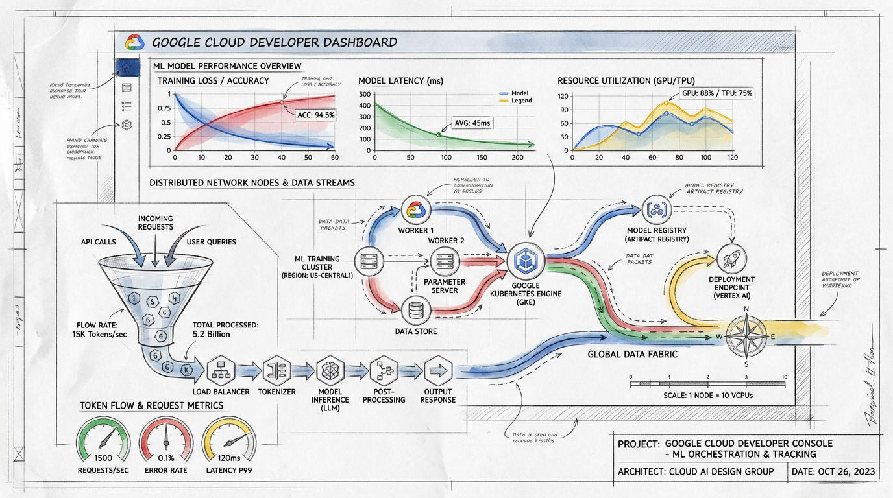

# ☕ Developer AI Tools Monitoring Dashboards

This repository contains two pre-configured Google Cloud Monitoring (GCM) dashboard templates designed to monitor token consumption, request rates, responsiveness, costs, and rate limits for **Agent Platform (GEAP) / Vertex AI** model invocations.

These are particularly useful for tracking model usage driven by developer productivity tools like **Antigravity** and **GeminiCLI**.

---

## 📊 Dashboard Catalog

### 1. Developer AI Tools: Aggregate Usage & Cost
👉 **[dashboards/geap-monitoring-dashboard.json](dashboards/geap-monitoring-dashboard.json)**
*   **What it is for**: High-level aggregate visibility of your project's model usage.
*   **Key Charts**:
    *   Token Consumption (Input vs. Output rates).
    *   Model Invocations broken down by Base Model ID.
    *   API Response Code distribution (Success vs. Errors).
    *   95th percentile of Time to First Token (TTFT).
    *   Rate Limit/Quota exhaustion occurrences (HTTP 429s).
    *   **Real-Time Estimated Cost Chart**: Real-time line chart tracking estimated cost trends by minute using PromQL.
    *   **Total Estimated Cost Table**: Dynamic PromQL-powered tabular summary calculating total estimated costs accumulated over the selected active timeframe with an explicit `"currency"` column showing `"USD"`.
    *   **Estimated Cost Information Card**: Embedded markdown note detailing standard pricing multipliers used for estimation (supporting modern models: Gemini 3.5 Flash, 3.1 Pro, 1.5 & 2.5 Flash, 1.5 Pro).
*   **Cost**: **$0.00 (100% Free)**. Re-uses free, built-in system metrics scaled via Prometheus Query Language (PromQL) with dynamic timeframe scaling.

### 2. Developer AI Tools: User Token Tracker
👉 **[dashboards/geap-monitoring-dashboard-v2.json](dashboards/geap-monitoring-dashboard-v2.json)**
*   **What it is for**: Tracking down-to-the-user token consumption, requests, and model choices.
*   **Key Charts**:
    *   Token Consumption by User over time.
    *   Total Tokens Consumed per User (Stacked Bar Chart).
    *   API Request counts by User over time.
    *   Model Types utilized per User.
*   **Cost**: **$0.00** for small-to-medium teams (fits comfortably within Google Cloud's logging and custom metrics free tiers).

> [!WARNING]
> **🛑 DOES NOT WORK OUT-OF-THE-BOX (WILL REMAIN BLANK BY DEFAULT)**
> 
> **TL;DR - Why it won't work yet:**
> 1. **No Global Audit Logs**: Developer tools (like `agy`) route requests to Vertex AI's logical `global` endpoint by default. GCP **does not write standard data-access audit logs** for global-endpoint traffic.
> 2. **No User Identity in Payloads**: Native platform-level payload logs redact the caller's email for privacy. Without audit logs or client overrides, GCM has no way to map a model request to a corporate identity, leaving all user-specific widgets completely empty.
> 
> **How to make it work**: Developers must update their workstation settings (`~/.gemini/antigravity-cli/settings.json`) to target a regional endpoint (e.g., `"location": "us-central1"`) to generate the required audit logs, or manually inject a custom `developer_email` request label.


---

## 👥 Who are these for?
*   **Developers & AI Engineers**: To track prompt and response sizes, measure application responsiveness, and optimize agent prompts.
*   **DevOps & Platform Engineers**: To monitor resource limits, predict quota adjustments, and isolate individual user-induced bottlenecks.
*   **Product Owners & Budget Holders**: To understand which users and teams are utilizing which models and allocate costs/chargebacks accurately.

---

## 💡 Why are they needed?
*   **Cost Control**: Large models (like Gemini Pro) are highly capable but more expensive than lightweight models (like Gemini Flash). These dashboards make it immediately clear who is calling which model, and how many tokens they are consuming.
*   **Reliability & Performance**: Slow agent responses are usually caused by model overhead or network latency. Monitoring the 95th percentile TTFT ensures your conversational agents remain snappy.
*   **Proactive Quota Management**: Vertex AI has rate limits. Monitoring rate limit exceeded events helps teams request quota increases *before* they impact developers or users.

---

## 💰 Cost Details

| Feature | Cost (PayGo) | Pricing Rationale |
| :--- | :--- | :--- |
| **Dashboard 1 (Aggregate)** | **$0.00** | Uses built-in Google Cloud system metrics which are completely free to ingest and store. |
| **Dashboard 2 (User Tracker)** | **$0.00** *(Most Teams)* | Custom log-based metrics. First **50 GiB/month** of logs and **150 MiB/month** of metrics are free. Beyond that, it is $0.50/GiB (logs) and $0.30/million samples (metrics). |
| **Request Metadata Labels** | **$0.00** | Vertex AI does not charge for attaching tags/labels to your API requests. |
| **BigQuery Billing Export** | **$0.00** *(Most Teams)* | BigQuery free tier provides **10 GiB** of storage and **1 TiB** of query processing per month. |

### 📈 Real-Time Cost Estimation (PromQL Estimates)
Dashboard 1 ("Developer AI Tools: Aggregate Usage & Cost") incorporates a **Real-Time Cost Estimation** section powered by Prometheus Query Language (PromQL). 

*   **How it works**: It matches token counts (input and output) for specific models and multiplies them by standard Vertex AI list pricing.
*   **Dynamic Timeframe Scaling**: Unlike hardcoded intervals, the **Total Estimated Cost Table** is fully responsive to the dashboard's active timeframe selection (e.g. Last 1 hour, Last 14 days). This is achieved using GCM's native `"outputFullDuration": true` configuration in combination with the dynamic PromQL range vector `[${__interval}]`, summing the exact token counts accumulated over the selected window.
*   **Explicit Currency Column**: The table includes an explicit `currency` column displaying `"USD"` for all models, populated dynamically via PromQL's `label_replace` function.
*   **Pricing Multipliers Used**:
    *   **Gemini 3.5 Flash**: Input: `$1.50 / 1M tokens` (multiplier `0.00000150`), Output: `$9.00 / 1M tokens` (multiplier `0.00000900`)
    *   **Gemini 3.1 Pro**: Input: `$2.00 / 1M tokens` (multiplier `0.00000200`), Output: `$12.00 / 1M tokens` (multiplier `0.00001200`)
    *   **Gemini 1.5 & 2.5 Flash**: Input: `$0.075 / 1M tokens` (multiplier `0.000000075`), Output: `$0.30 / 1M tokens` (multiplier `0.00000030`)
    *   **Gemini 1.5 Pro**: Input: `$1.25 / 1M tokens` (multiplier `0.00000125`), Output: `$5.00 / 1M tokens` (multiplier `0.00000500`)
*   **Estimated vs. Actual**: 
    > [!IMPORTANT]
    > These metrics represent **estimated, real-time tracking** of model cost. They are intended for immediate visibility, budgeting, and capacity planning. They do **not** represent official final Google Cloud invoices, which are generated in Looker/BigQuery based on precise billing-SKU logs.

---

## 🚀 How to Deploy

Both dashboards have been pre-validated and successfully deployed to your project `coffee-and-codey`.

Should you need to re-create or deploy them to another environment:

### Method A: Via `gcloud` CLI (Recommended)
From the directory containing the dashboard JSON files, run:
```bash
# Deploy Dashboard 1 (Aggregate Usage & Cost)
gcloud monitoring dashboards create \
  --project="coffee-and-codey" \
  --config-from-file=dashboards/geap-monitoring-dashboard.json

# Deploy Dashboard 2 (User Token Tracker)
gcloud monitoring dashboards create \
  --project="coffee-and-codey" \
  --config-from-file=dashboards/geap-monitoring-dashboard-v2.json
```

### Method B: Via Cloud Console
1.  Copy the JSON from the desired file.
2.  Go to **Google Cloud Console > Monitoring > Dashboards**.
3.  Click **+ Create Dashboard**.
4.  Click the **JSON Editor** button in the top-right corner of the builder.
5.  Paste the JSON, click **Apply**, and then click **Save**.

---

## 🛑 The Regional Endpoint Mandate (Critical Requirement)

To track user-level metrics in **either** Google Cloud Monitoring (GCM) or BigQuery, developer clients (including **Antigravity CLI** and custom SDK scripts) **MUST** route their requests through a **regional endpoint** (such as `us-central1`) instead of the logical `global` endpoint.

### Why is this required?
* **No Global Audit Logs**: The Vertex AI global multi-region routing endpoint (`location="global"`) does **not** write standard `DATA_READ` audit logs to Cloud Logging.
* **Blank GCM Dashboards**: Without audit logs, GCM cannot extract the caller's email (`principalEmail`), leaving GCM user widgets completely blank.
* **No BigQuery Email Mapping**: BigQuery cost attribution is performed by running an `INNER JOIN` between payload logs and data access audit logs on the `request_id`. If you call the global endpoint, no audit log is written, so the user's calls will not appear in the cost report.

### 💻 Local Antigravity CLI Configuration
To force the Antigravity CLI (`agy`) on developer workstations to target a regional endpoint (enabling full user auditing and GCM metric reporting):
1. Open the global settings file at: `~/.gemini/antigravity-cli/settings.json`
2. Update `"location"` from `"global"` to `"us-central1"` (or your preferred GCP region) under the `"gcp"` section:
   ```json
   "gcp": {
     "project": "coffee-and-codey",
     "location": "us-central1"
   }
   ```
3. Save the file and restart any active CLI sessions.

---

## 🛠️ User Tracking Setup (User Token Tracker Ingestion)

To feed user-level metrics into the **Developer AI Tools: User Token Tracker** dashboard, the system queries a custom logs-based metric named **`user_tokens`**.

We have pre-configured and provided two ready-to-use YAML definitions for this metric, and **Solution A2 (Native Request-Response Logging) is already deployed and active** in your project!

---

### 💎 Solution A2: Native Request-Response Logging (Exact Token Counts) - *DEPLOYED & ACTIVE!*
*   **What it does**: Tracks exact input, output, and cached token sizes per developer natively inside Google Cloud's infrastructure, using `PublisherModelConfig` with **zero custom proxy servers to manage** and **100% pre-auth enforcement**!
*   **Deployment Status**: **Successfully deployed and active on `gemini-2.5-flash` (region `us-central1`) and `gemini-3.5-flash` (location `global`) in project `coffee-and-codey`!**
*   **Configuration File**: [metrics/user-tokens-proxy.yaml](metrics/user-tokens-proxy.yaml)
*   **How it was deployed**:
    1. Native `PublisherModelConfig` was registered for `gemini-2.5-flash` in region `us-central1`, and for `gemini-3.5-flash` using `location="global"` and the global multi-region endpoint.
    2. The `user_tokens` custom log-based metric was configured with the distribution schema:
       ```bash
       gcloud logging metrics update user_tokens --config-from-file=metrics/user-tokens-proxy.yaml
       ```
*   **Developer Environment Setup**: Developers must ensure that local environments have no legacy proxy endpoint overrides (remove/unset `VERTEX_API_ENDPOINT`) and are logged in natively using standard Application Default Credentials:
    ```bash
    gcloud auth application-default login
    ```

---

### ⚡ Solution A1: No-Code Audit Logs (Request Counts) - *Alternative Fallback*
*   **What it does**: Tracks developer request counts (as an alternative fallback) by intercepting Vertex AI API activity audit logs. This tracks request frequencies but cannot extract exact token volumes due to audit privacy rules.
*   **Configuration File**: [metrics/user-tokens-audit-log.yaml](metrics/user-tokens-audit-log.yaml)
*   **How to fallback**: To transition back to tracking request counts, update the `user_tokens` metric:
    ```bash
    gcloud logging metrics update user_tokens --config-from-file=metrics/user-tokens-audit-log.yaml
    ```

---

## 📊 Request-Level Metadata Labels (Billing & BigQuery)

If your goal is financial auditing, chargeback, or cost attribution, Vertex AI natively supports **request-level metadata labels**. When you add labels to a `generateContent` request, they automatically propagate to **Cloud Billing** and are exported to **BigQuery**.

### Step 1: Add Labels to your API Requests
Simply include a `labels` dictionary containing user and department details directly inside your API client configuration:

```python
from google import genai

client = genai.Client()
response = client.models.generate_content(
    model='gemini-2.5-flash',
    contents='Summarize this document...',
    config={
        "labels": {
            "user_id": "rob_edwards_altostrat_com",
            "department": "sales_engineering",
            "environment": "production"
        }
    }
)
```

> [!IMPORTANT]
> Label keys must start with a lowercase letter and can only contain lowercase letters, numbers, underscores, and dashes (up to 63 characters). 
> **Note**: Labels are forwarded to Cloud Billing for standard Pay-As-You-Go pricing; requests under Provisioned Throughput are not tracked this way.

### Step 2: Query Cost by User in BigQuery
Once your Google Cloud Billing export to BigQuery is enabled, you can run SQL queries to get a down-to-the-penny report of how much money each user is spending on Gemini models:

```sql
SELECT 
  labels.value AS user_id,
  sku.description AS model_sku,
  SUM(usage.amount) AS total_tokens,
  SUM(cost) AS total_cost_usd
FROM 
  `your-project.billing.gcp_billing_export_v1_XXXXXX`,
  UNNEST(labels) as labels
WHERE 
  service.description = "Vertex AI"
  AND labels.key = "user_id"
GROUP BY 1, 2
ORDER BY total_cost_usd DESC;
```

You can then connect this BigQuery dataset directly to Looker Studio for beautiful cost chargeback reporting.

---

## 📚 Reference Guides
For deep-dive setup instructions and integration code, see:
*   👉 **[docs/HOW_TO_COLLECT_USER_DATA.md](docs/HOW_TO_COLLECT_USER_DATA.md)**: Full steps to collect data from CLI runtimes.
*   👉 **[docs/USER_AND_USAGE_TRACKING_GUIDE.md](docs/USER_AND_USAGE_TRACKING_GUIDE.md)**: Complete guide on log-based metric types, distribution extraction, and Looker/BigQuery analytics.
